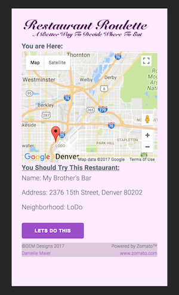
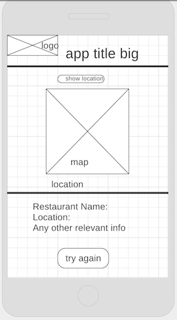

This app is built using jQuery, milligram.io css framework, Zomato's api and
Google Maps api.

# Restaurant Roulette

This app is for every person out there who can never decide were to eat.
Restaurant Roulette is a single page app that will help you decide where to eat.
It does this by taking the users GPS location and sending it to the zomato.com
API. The app will choose a random restaurant to display. If you the suggestion
go and have a great time, if not hit the button and try again.

Screenshot:

## Deployment

URL:
[link](https://restaurant-roulette-30fc6.firebaseapp.com/)https://restaurant-roulette-30fc6.firebaseapp.com/

## Built With

* [Milligram](http://milligram.io/) - The web framework used
* [jQuery](https://jquery.com/) - Dependency Management

## Authors

* **Danielle Maier** - *Initial work* - [Danielle-Maier](https://github.com/danielle-maier)
Trello board:[link](https://trello.com/b/m6FEISoz/restaurant-roulette)
